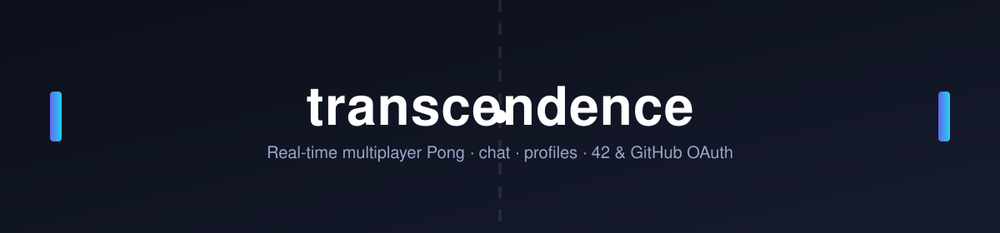
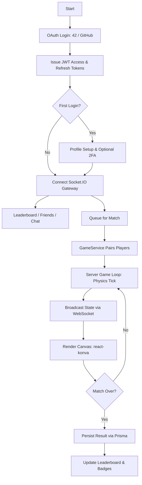

<header>
<h1 align="center">
  <a href="https://github.com/jdecorte-be/transcendence"></a>
  <br>
</h1>

<p align="center">
  A full-stack real-time multiplayer Pong platform with live chat, OAuth login, and social features, built on NestJS, React, and Socket.IO.
</p>

<p align="center">
<a href="https://www.42.be">
    
  </a>
<a href="#">
    
  </a>
<a href="#">
    
  </a>
<a href="#">
    
  </a>
</p>

<p align="center">
<a href="#">
    
  </a>
  <a href="https://github.com/jdecorte-be/transcendence/stargazers">
    
  </a>
  <a href="https://github.com/jdecorte-be/transcendence/issues">
    
  </a>
  <a href="https://github.com/jdecorte-be/transcendence">
    
  </a>
  <a href="https://github.com/jdecorte-be/transcendence">
    
  </a>
</p>
<p align="center">
  <a href="#key-features">Key Features</a> •
  <a href="#architecture">Architecture</a> •
  <a href="#logic-flow">Logic Flow</a> •
  <a href="#system-flow-diagram">System Flow Diagram</a> •
  <a href="#prerequisites">Prerequisites</a> •
  <a href="#installation-and-building">Installation</a> •
  <a href="#usage">Usage</a>
</p>
</header>

**transcendence** is a full-stack re-implementation of the classic Pong arcade game, turned into a real-time multiplayer social platform. This project is a deep dive into WebSocket-driven game state synchronization, OAuth-based authentication, and building a production-style microservice stack around a stateful, latency-sensitive game loop.

The platform lets players authenticate via 42 or GitHub, chat in public/private rooms and DMs, add friends, customize an avatar, climb a ranked leaderboard, and challenge each other (or a bot) to live Pong matches rendered over WebSockets.

## Key Features

-   **Real-Time Multiplayer Pong**: Server-authoritative game loop broadcasting paddle/ball state over Socket.IO, rendered client-side with `react-konva`.
-   **Dual OAuth Login**: Authenticates users via **42 (ft)** and **GitHub** OAuth strategies through Passport, issuing short-lived access tokens and refresh tokens.
-   **Two-Factor Authentication**: Optional TOTP-based 2FA (`otplib` + QR code enrollment) layered on top of OAuth login.
-   **Live Chat & Rooms**: Public channels, private rooms, and direct messages over WebSocket gateways, with role-based moderation (mute/ban/kick).
-   **Friends & Social Graph**: Send/accept friend requests, view online status, and track rivalries.
-   **Leaderboard & Badges**: Ranked ladder based on match history, with unlockable badge tiers (Newbie, Master, Ultimate).
-   **Custom Avatar Builder**: Profile picture uploads and composable avatar assets stored via Cloudinary.
-   **Bot Opponent**: Local single-player mode against a scripted AI when no human opponent is available.

## Architecture

### Logic Flow

1.  **Authentication**: User logs in via 42 or GitHub OAuth. Passport strategies exchange the code for a profile, and the backend issues JWT access/refresh tokens as cookies.
2.  **First Login**: New accounts are routed through profile setup (username, avatar, optional 2FA enrollment).
3.  **Gateway Connection**: The frontend opens a Socket.IO connection, authenticated via the JWT, to the NestJS gateway layer.
4.  **Social Layer**: Users browse the leaderboard, manage friends, and join chat rooms — all backed by REST endpoints and Prisma-modeled Postgres tables.
5.  **Matchmaking**: A player queues for a match (classic or extra mode); the `GameService` pairs waiting sockets and emits event-driven state updates.
6.  **Game Loop**: The server computes paddle/ball physics each tick and broadcasts state to both clients, which render it via `react-konva` canvases.
7.  **Post-Match**: Results are persisted to Postgres via Prisma, updating leaderboard rank and badge progress, and the game room is torn down.

### System Flow Diagram



## Prerequisites

-   **Operating System**: Linux/macOS (containerized, so any Docker host works)
-   **Runtime**: [Docker](https://www.docker.com/) + Docker Compose
-   **OAuth Apps**: A registered 42 (ft) OAuth application and/or GitHub OAuth application, for login callbacks
-   **Cloudinary Account**: Required for avatar upload storage

## Installation and Building

### 1. Clone the Repository

```bash
git clone https://github.com/jdecorte-be/transcendence.git
cd transcendence
```

### 2. Configure Environment Variables

```bash
cp .env.example .env
```

At minimum, set `AT_SECRET` / `RT_SECRET` (e.g. `openssl rand -hex 32` each). OAuth login (42, GitHub) and avatar uploads (Cloudinary) each need their own credentials to function.

### 3. Start the Dev Stack

```bash
docker compose -f docker-compose-dev.yaml up --build
```

This starts:
-   **frontend** — `http://localhost:3000` (hot reload)
-   **backend** — `http://localhost:3001` (hot reload), plus Prisma Studio on `http://localhost:5555`
-   **database** — PostgreSQL

### 4. Open the App

Navigate to `http://localhost:3000`.

## Production

```bash
docker compose -f docker-compose.yml up --build -d
```

Requires a production `.env` with real domains/secrets (see `.env.example` for the full list of variables).

## Usage

| Area          | Description                                              |
| :------------ | :--------------------------------------------------------- |
| Login          | Authenticate via 42 or GitHub OAuth from the landing page. |
| Play           | Queue for a live match, or play locally against the bot.  |
| Chat           | Join public rooms, DM friends, or create private rooms.   |
| Profile        | Customize your avatar, review match history and badges.   |
| Leaderboard    | Track global rank against other players.                  |

## Troubleshooting

| Issue                                  | Probable Cause                                     | Resolution                                                                 |
| :-------------------------------------- | :-------------------------------------------------- | :--------------------------------------------------------------------------- |
| OAuth callback fails                    | Callback URL mismatch or missing client credentials. | Verify `FT_CALLBACK_URL` / `GITHUB_CALLBACK_URL` match the values registered with each provider. |
| WebSocket connection refused            | CORS origin mismatch or backend not ready.          | Check `WS_CORS_ORIGIN` matches the frontend origin, and the backend container is healthy. |
| Avatar upload fails                     | Missing or invalid Cloudinary credentials.          | Verify `CLD_CLOUD_NAME`, `CLD_API_KEY`, `CLD_API_SECRET` in `.env`.        |
| Prisma migration errors on startup      | Stale schema or unreachable database.               | Confirm `DATABASE_URL` is correct and the `database` container is running. |
